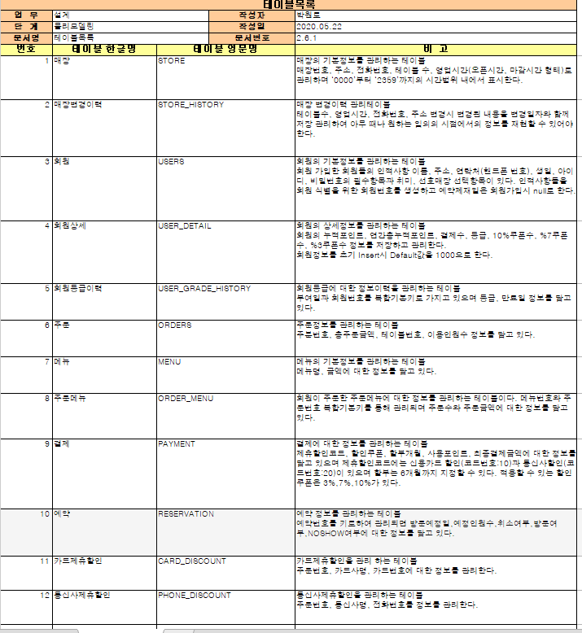

StoreReservation

language: java, JSP

레스토랑 예약 시스템을 관리하는 관리자, 사용자 계정을 구분하여 사용할 기능을 구분.  

- 관리자  
* 매장 정보 추가/수정/삭제
* 메뉴 정보 추가/수정/삭제
* 예약 확인 및 처리
* NoShow 패널티 적용
* 회원관리(사용자 등급 적용, 포인트)
* 결제(통신사 및 카드 제휴할인)
- 사용자
* 회원가입
* 주문하기
* 주문현황 확인
* 예약 및 예약 취소(예약시간까지 2시간 남지 않았을 경우 예약 취소 불가)

DTO, DAO를 만들어서 구현.

### Table List

